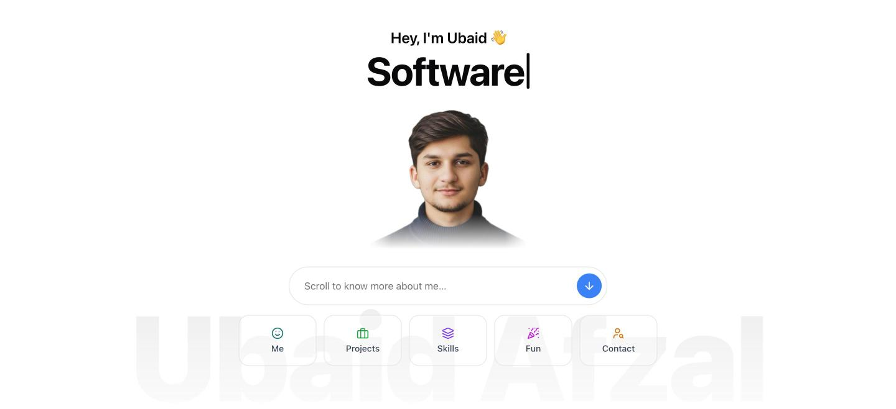

<div align="center">

# Ubaid Afzal · Portfolio

**Software Engineer · Backend Engineer · Prompt Engineer**
CS student at FAST University, founder of [Mealopia](https://mealopia.com)

### 🌐 [ubaidafzal01.github.io/Ubaid-Afzal](https://ubaidafzal01.github.io/Ubaid-Afzal/)



</div>

## ✨ Highlights

- **Fluid ink cursor:** a real-time WebGL fluid simulation (advection, vorticity and pressure solve) that swirls colourful ink behind the page as you move the mouse
- **Glassmorphism UI:** frosted-glass cards, buttons and popups (`backdrop-filter`) on top of the fluid
- **Typing title:** cycles through *Software Engineer → Backend Engineer → Prompt Engineer*
- **Project popups:** native `<dialog>` modals with full project details and a "see it live" chooser (mobile app or website)
- **Smooth scrolling one-pager** with a floating dock that highlights the current section, plus scroll-reveal animations
- **Responsive and accessible:** works down to phone width and respects `prefers-reduced-motion`
- **Zero dependencies:** plain HTML, CSS and JavaScript with no frameworks and no build step

## 🗂️ Sections

| Section | What's inside |
| --- | --- |
| **Hero** | Photo, typing title, quick-jump glass cards |
| **About** | Bio, tags, stats, CV download |
| **Projects** | Mealopia · C++ Quiz Game · Flexin Shoe Store · Laham Cattle Farm |
| **Skills** | Tech-stack logos: languages, backend & cloud, tools, core CS |
| **Fun** | Gaming, travelling, coding |
| **Contact** | Email, CV, GitHub, LinkedIn, WhatsApp |

## 🛠️ Tech

`HTML5` · `CSS3` (custom properties, backdrop-filter, grid) · `Vanilla JavaScript` · `WebGL` (GLSL shaders) · `IntersectionObserver` · `<dialog>`

## 📁 Structure

```
├── index.html     # all page content
├── style.css      # design tokens, glass styles, layout, responsive rules
├── script.js      # typing effect, scroll reveal, dock, popups
├── fluid.js       # WebGL fluid simulation for the cursor effect
└── assets/        # photos, project images, logo, CV
```

## 🚀 Run locally

```bash
git clone https://github.com/ubaidafzal01/Ubaid-Afzal.git
cd Ubaid-Afzal
python3 -m http.server 5173
```

Then open http://localhost:5173.

## ✏️ Customise

- Text and projects live in `index.html`. Each project is one `<article>`, and its details popup is a `<dialog>` near the end of `<main>`.
- Typing titles: edit `data-words` on the `.typed` element (separate titles with `|`).
- Colours: edit the variables at the top of `style.css`.
- Fluid feel: tweak `config` at the top of `fluid.js`.

## 📬 Contact

**Email:** ubaidafzal117@gmail.com · **LinkedIn:** [ubaid-afzal](https://www.linkedin.com/in/ubaid-afzal-06483137b/) · **GitHub:** [@ubaidafzal01](https://github.com/ubaidafzal01)
